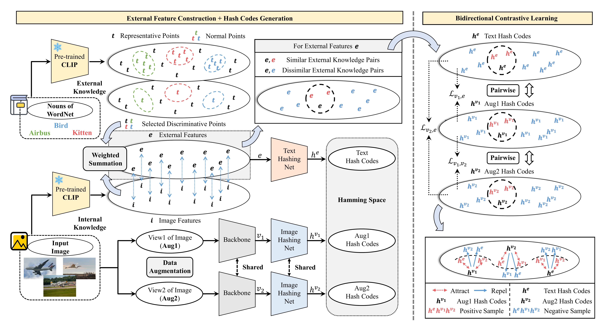

# Deep Unsupervised Hashing via External Guidance

This repository contains the code for the paper **"Deep Unsupervised Hashing via External Guidance"** (ICML 2025).

Our approach aims to leverage external knowledge beyond the inherent visual structure of images to facilitate unsupervised hashing code learning. By introducing external textual information, we provide richer and more precise guidance for hashing network learning, thereby enhancing the discriminability of the generated binary codes.


---

## 📁 Project Structure
```
main/
├── data/ # Data directory
│   ├── cifar-10-batches-py/ # cifar-10 dataset
│   │   └── train_index.txt
│   ├── flickr25k/ # Flickr25k dataset
│   │   ├── query_index.txt
│   │   ├── retrieval_index.txt
│   │   └── train_index.txt
│   ├── mscoco/ # MSCOCO dataset
│   │   ├── database.txt
│   │   ├── test.txt
│   │   └── train.txt
│   ├── nus-wide/ # NUS-WIDE dataset
│   │   ├── database_img.txt
│   │   ├── database_label_onehot.txt
│   │   ├── test_img.txt
│   │   ├── test_label_onehot.txt
│   │   ├── train_img.txt
│   │   └── train_label_onehot.txt
│   └── WordNet_Nouns.csv # Nouns from WordNet
├── dataset.py # Dataset loader
├── dataset_extract.py # Data extraction scripts
├── eval_hash.py # Evaluation script
├── models.py # Model architecture definitions
├── nouns_embed.py # External guidance embedding script
├── README.md # Project readme
├── requirements.txt # Project requirements
└── train.py # Main training script
```

---

## ⚙️ How to Run the Code

Here’s how to run this project step by step:

1️⃣ **Extract visual features**  
First, run `dataset_extract.py` to preprocess and extract visual features from the images in each dataset:

```bash
python dataset_extract.py
```

2️⃣ **Extract external textual features**  
Next, run nouns_embed.py to preprocess and extract external textual features (e.g., from WordNet):

```bash
python nouns_embed.py
```

3️⃣ **Train and evaluate the hashing network**  
Finally, run train.py to train the deep hashing network and evaluate its performance:

```bash
python train.py
```
---

## 📚 Datasets

Below is a list of the open-source datasets used in this paper, along with their corresponding sources.

| Dataset                           | Corresponding Sources                                               |
|-----------------------------------|---------------------------------------------------------------------|
| **CIFAR-10**                      | [Will be downloaded automatically](https://www.cs.toronto.edu/~kriz/cifar-10-python.tar.gz) |
| **Flickr25k**                     | [https://press.liacs.nl/mirflickr/](https://press.liacs.nl/mirflickr/mirdownload.html) |
| **MSCOCO**                        | [Obtained from FSCH (TCSVT 2023)](https://github.com/huanglab-research/FSCH/tree/main)                |
| **NUS-WIDE**                      | [Obtained from DSDH (NeurIPS 2017)](https://github.com/Tree-Shu-Zhao/DSDH_PyTorch?tab=readme-ov-file) |
| **WordNet**                       | [https://wordnet.princeton.edu/](https://wordnet.princeton.edu/)    |
